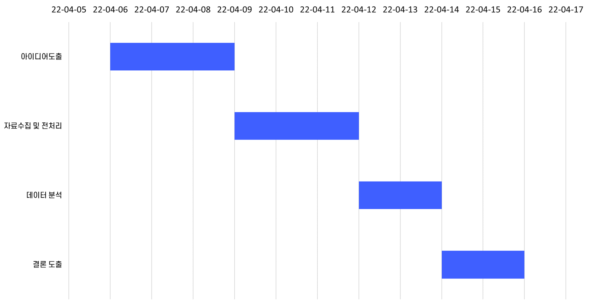
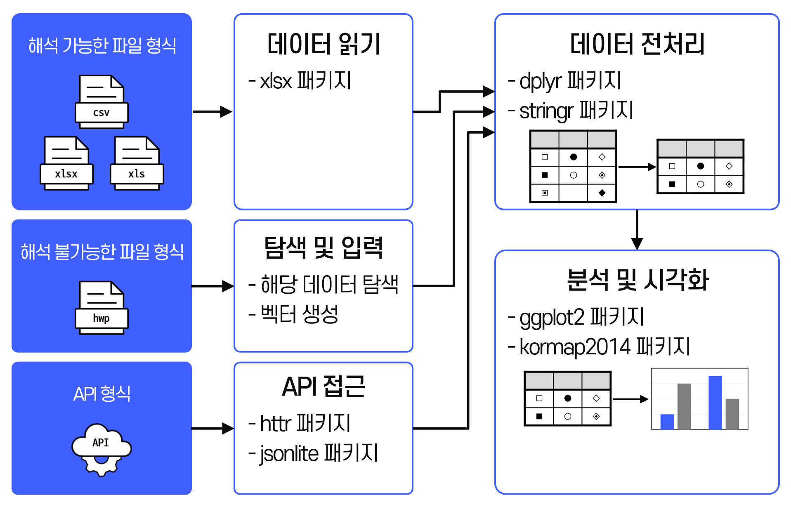
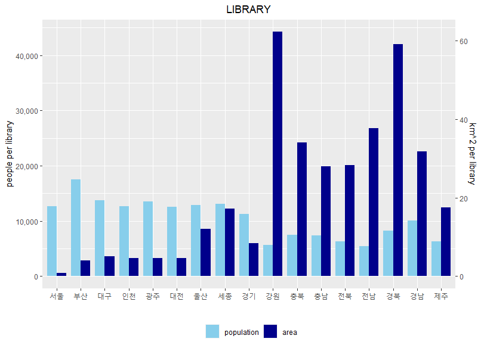
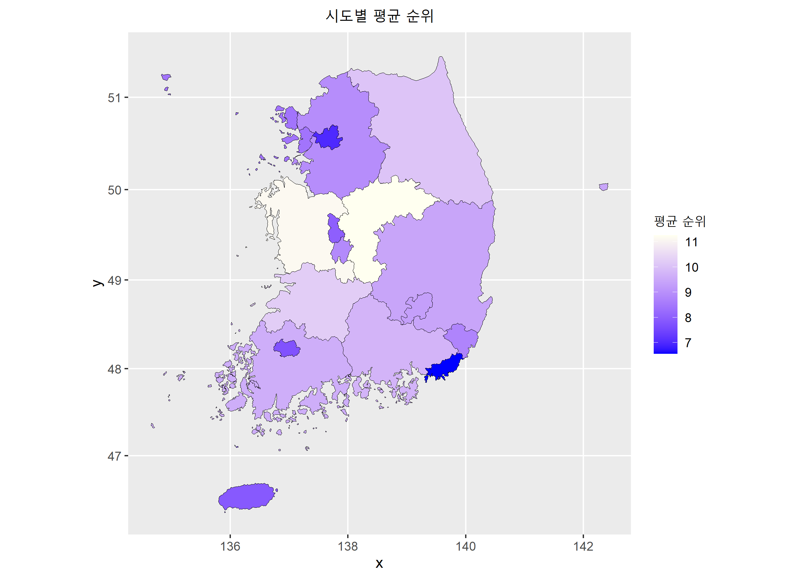

## 시도별 생활 SOC 분석

### 개요
R을 이용한 시도별 생활 SOC 분석

### 기술스택
</a>

### 수행배경
- 수도권에 다양한 시설이 얼마나 집중되어있는지 생활 SOC*를 통해 시도별로 분석을 해보고 싶었습니다.

* 생활 SOC(Social Overhead Capital): 국민생활 편익 증진시설로 복지, 공원, 도서관 등

### 진행일정

### 수행과정

### 분석결과
- 분석결과 중 하나인 도서관 차트
  

- 시도별 SOC 순위 평균에 따른 차트
  

- 격차에 따른 시설 구분
  - 가장 격차가 심한 시설: 주민건강센터
  - 가장 격차가 적은 시설: 공원
  
- 시설이 잘 갖춰진 광역시, 도
  - 광역시: 부산광역시
  - 도: 경기도
  
- 시설이 부족한 광역시, 도
  - 광역시: 대구광역시
  - 도: 충청북도
  
- 수도권 집중 현상
  - 서울시, 인천시, 경기도 모두 중상위권에 분포한 점을 통해 수도권 집중 현상 확인 

### 후기
- API 이용 중 안내된 데이터 개수와 실제 데이터 개수 달라 헤맨 적이 있었습니다. 결론은 제공하는 측에서 실수였습니다. <u><b>데이터는 그 출처가 명확한 것과 별개로 철저하게 검증해야 한다는 점을 배웠습니다.</b></u>
- 지역의 전체 인원 대신 각 시설의 주 사용자층의 인원을 이용했다면 보다 유의미한 결과를 도출할 수 있으리라 생각합니다. 하지만 유아층 인원을 파악하는데 실패해서 지역의 전체 인원으로 진행했습니다. <u><b>필요한 데이터를 탐색하는 과정을 보완할 필요성을 느꼈습니다.</b></u>
